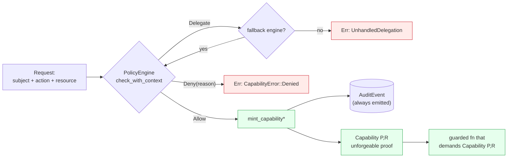
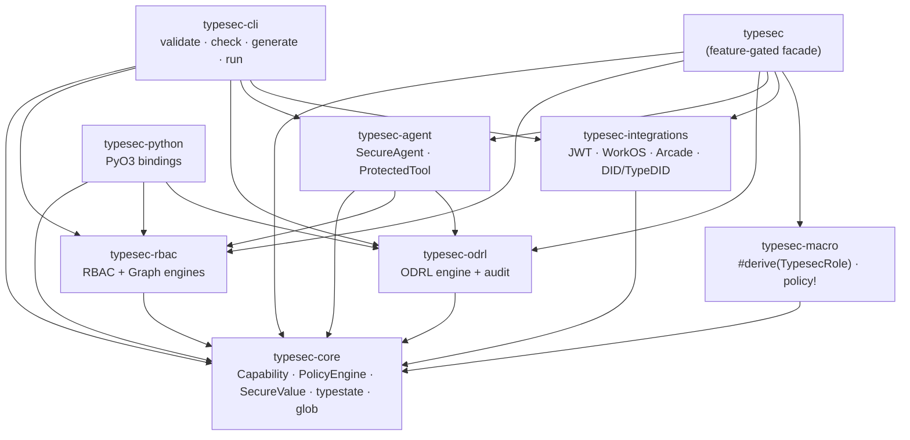
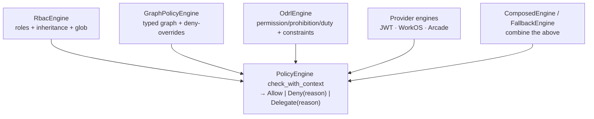
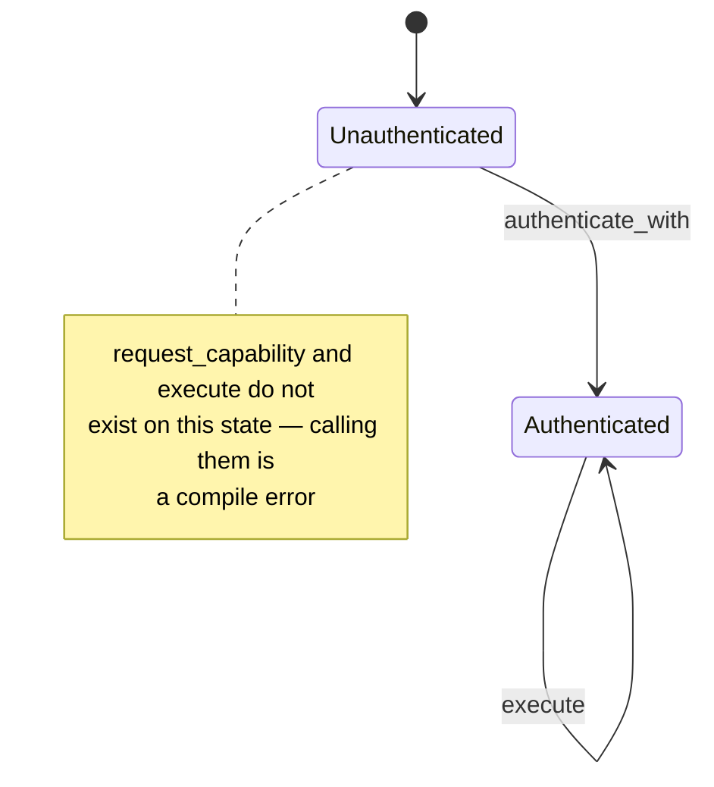
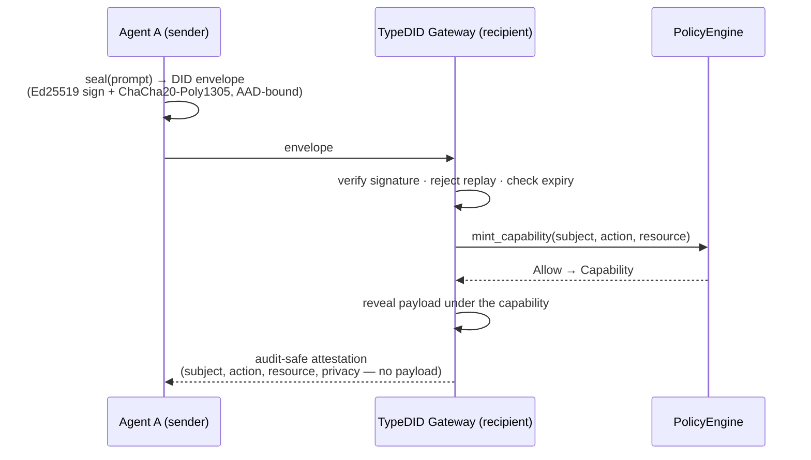

# Typesec architecture

Diagrams for the load-bearing pieces of Typesec. They render on GitHub and in any
Mermaid-aware viewer. For the prose walkthrough see the book
([`docs/book/typesec.md`](book/typesec.md)); for a runnable version of the core
loop see [`examples/core_capability.rs`](../examples/core_capability.rs).

## The capability-minting flow

The single load-bearing invariant: a `Capability` is unforgeable proof, and the
*only* production path to one is `mint_capability*`, which runs a `PolicyEngine`
and emits an audit event. A denial yields a typed error, never a capability.

The proof cannot exist without a policy decision, and the privileged function
cannot be reached without the proof.

## Workspace layering

Nine crates. Everything is built on `typesec-core`; the umbrella `typesec` crate
re-exports the rest behind feature flags.

## One policy contract, many engines

Every engine implements the same `check_with_context` → `Allow | Deny |
Delegate` interface, so they compose. `ComposedEngine` folds several engines
under a strategy (priority, deny-overrides, allow-if-any); `FallbackEngine`
chains a primary to a secondary on `Delegate`.

## The agent typestate

`SecureAgent<S>` is a typestate machine. The capability-requesting and
`execute` methods exist *only* on the `Authenticated` state — an unauthenticated
agent literally has no such methods to call.

## DID / TypeDID agent-to-agent messaging

When agents collaborate, a prompt is sealed into a DID envelope whose ciphertext
is AEAD-bound to its routing/timing identity. The gateway verifies signature,
replay, and expiry, then the plaintext is revealed only under a typed
capability — and an audit-safe attestation records who did what to which
resource, without exposing the payload.

